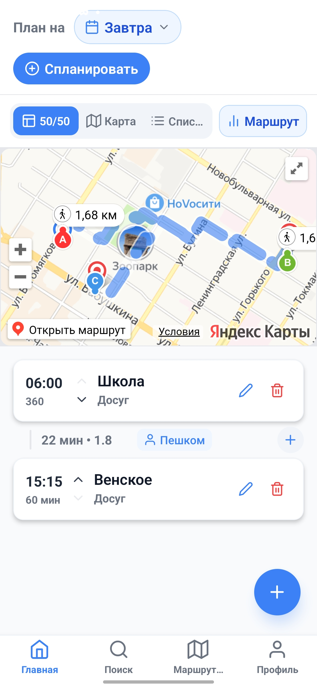
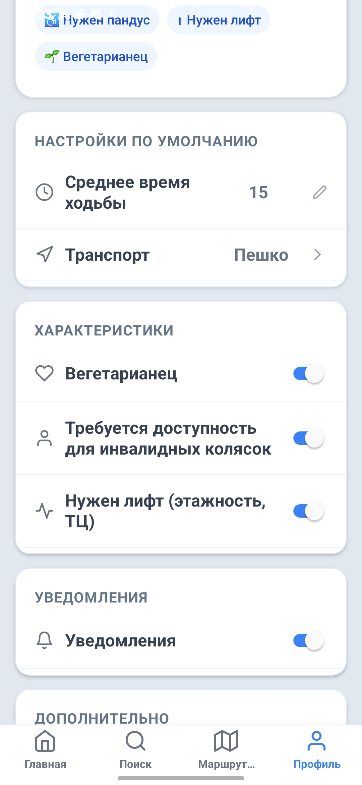

# Мобильное приложение для планирования досуга

Краткое техническое описание проекта. Укажите основное назначение приложения и решаемые им задачи.

## Скриншоты

| Главный экран | Профиль |
| :---: | :---: |
|  |  |

## Стек технологий

- Framework: Expo (React Native)
- Язык: TypeScript / JavaScript
- Сторонние API: Yandex Maps API, Overpass API
- Навигация: React Navigation
- Web-демонстрация интерфейса:

## Готовые сборки (Артефакты)

Готовая к установке версия приложения для ОС Android (APK-файл) находится в папке:
`/builds/`

Вы можете загрузить этот файл на свое Android-устройство для тестирования функционала без необходимости развертывания среды разработки.

## Инструкция по запуску проекта

Для запуска проекта в режиме разработки выполните следующие действия:

### 1. Клонирование репозитория

```bash
git clone https://github.com/Tsuk1y0Dev/MyDosug.git
cd repository-name
npm install
npx expo
